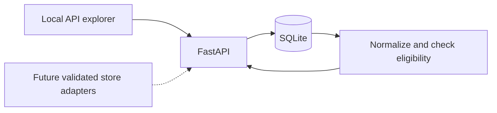

# Architecture

## Initial boundary

A single local Python process serves a FastAPI API and stores data in SQLite.
Each observation preserves its original package quantity, unit, pack count,
price, store, channel, time and manual approval. The comparison layer computes
unit prices with Decimal arithmetic and applies deterministic eligibility rules.
No live adapters or scheduler run in the initial release.

## Present data model

- Staple: a shopping need, comparison basis, acceptance notes and needed flag.
- Store: retailer identity, explicit connection status, note, and a pointer to
  its preferred immutable location context.
- Location context: store, original display label, optional retailer location ID,
  shopping-channel preference and user-reported/tentative/unconfigured status.
  Exact identities are reused; contexts cannot be updated or deleted.
- Observation: product label, original amount and price, dated evidence,
  authoritative evidence channel and immutable context ID. Approval currently
  belongs to each manually entered observation. Store/context ownership is a
  composite foreign key, so one retailer cannot use another retailer's context.

Configuration and source verification are distinct. Choosing a location only
records the user's preference. Tentative Walmart #5969 and user-reported Wegmans
#133 retain those qualifications, and Lidl remains unconfigured until selected.
All automated sources remain not connected; configuration writes cannot change
that status. The context's channel is a preference: original online/pickup manual
observations remain valid evidence without turning into shelf observations.

This is intentionally a manual-input foundation. It is not yet a catalog matching
system. Before automated retrieval, add product variants with retailer IDs and
barcode identities, and persistent approved matches between variants and staples.
Do not infer those identities from product name alone.

## Comparison semantics

- Weight: normalize to avoirdupois ounces (grams, kilograms, pounds, ounces).
- Liquid volume: normalize to US fluid ounces (milliliters, liters, fluid ounces).
- Count: normalize to each. The staple rules must still ensure that the counted
  units are meaningfully comparable (for example eggs of an acceptable size).
- Never cross dimensions or infer density.
- Total quantity = per-pack quantity × pack count.
- Unit price = whole purchase package price / total normalized quantity.
- A winner is the lowest eligible unit price. It says nothing about required
  purchase quantity, travel cost, or full-basket total yet.
- A current observation must be under 48 hours old; future dates are invalid.
- Conditional prices are stored but excluded until offer logic is implemented.
- Online and pickup offers are visible but excluded from the initial shelf winner.

Preserve history. The comparison view uses the latest observation per currently
identified product/store/context/channel, including a later unavailable observation.
It must not resurrect an old cheap price merely because the latest is ineligible.
The initial identity includes product name, canonical quantity, unit and pack
count so distinct package sizes remain visible. Stable retailer IDs replace
this temporary identity before catalog fetching. A store without a configured
location cannot supply a winning observation. Changes to a staple's name, basis,
or rules clear old approvals across all contexts while preserving price records.

## Store preferences and history

Changing a preference creates/selects a context and only moves the store's
preferred-context pointer. It never relabels observations, changes their context,
or copies approvals into another context. Old records remain accessible through
`GET /api/observations`; `GET /api/stores/{id}/contexts` exposes context history.
The original store location/channel columns are maintained as compatibility
copies, but API reads and historical labels come from immutable contexts.

Default comparisons filter to each store's current context. Optional previous
contexts stay visibly excluded with `location_not_current`; unconfigured evidence
also retains `location_not_configured`. Ranking partitions by context, preventing
a newer observation in one location from hiding another location's price. A switch
back reuses the original observations and approvals, subject to current age and
staple-rule checks. Store preference changes themselves do not revoke approvals.

Explicit context IDs on new observations preserve a stale client's actual
selection. For compatibility, omitted IDs resolve to the current preference under
the same writer transaction as insertion. Such older clients cannot express the
location they previously displayed and should adopt explicit IDs. Store edits,
observation insertion, and staple rule changes acquire a writer transaction before
reading mutable state. Comparison reads share a transaction snapshot.

## Schema upgrades

The original schema is version 0; `PRAGMA user_version = 1` adds immutable contexts
and observation context references. New empty databases use the same migration.
Migration snapshots each store's original location into one context, binds every
existing observation to it, and preserves all original observation fields.
Existing channel values remain authoritative. Known seeded location IDs are only
filled for the exact original Wegmans/Walmart labels; no other IDs are inferred.
The original schema cannot establish any location history older than that snapshot.

A single explicit `BEGIN IMMEDIATE` covers DDL, row copying, foreign-key checks
and the version change. No `executescript` is used inside migrations because it
can commit a pending transaction. Failure rolls back the whole upgrade, allowing
a subsequent retry; concurrent initializers serialize and observe the committed
version. Newer unsupported versions are refused. Foreign keys and triggers guard
context ownership, preferred-context validity, and context immutability.
Regression tests use an independent original-schema fixture, inject a failure
after table replacement, retry, and verify all original rows and schema survive.
No real shopping database is used for migration tests.

## Evolution before connecting stores

1. Product/variant and approved-match tables, with migrations and stable retailer IDs.
2. Source adapter interface returns typed observations and explicit failures.
3. Store location and channel from the response must agree with the request.
4. Fetched-at, observed-at, promotion-valid-until and last-attempt are distinct.
5. Refresh runs are idempotent and independently transactional per source.
6. A pickup comparison can rank pickup offers in its own mode; shelf mode must
   not mix in those prices implicitly.
7. Invalidating a staple's rules invalidates affected approvals, not price history.

## Local operation

Use localhost until authentication and deployment are deliberately implemented.
The API rejects cross-origin writes and non-JSON write payloads. This reduces
browser-origin risks but is not user authentication. Database files and secrets
are excluded from git. Tests use temporary databases, never real shopping data.

CI runs the offline test suite on pushes and pull requests. Retailer live smoke
checks will be separate, opt-in, and modest in volume.
