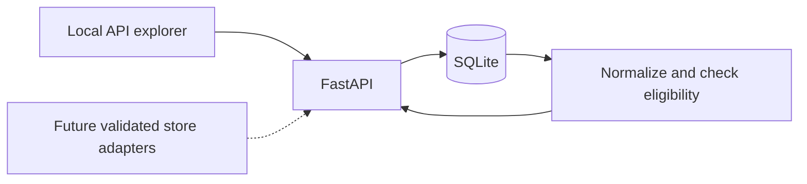

# Architecture

## Initial boundary

A single local Python process serves a FastAPI API and stores data in SQLite.
Each observation preserves its original package quantity, unit, pack count,
price, store, channel, time and manual approval. The comparison layer computes
unit prices with Decimal arithmetic and applies deterministic eligibility rules.
No live adapters or scheduler run in the initial release.

## Present data model

- Staple: a shopping need, comparison basis, acceptance notes and needed flag.
- Store: configured retailer/location and explicit connection status.
- Observation: product label, original amount and price, dated evidence and
  channel. Approval currently belongs to each manually entered observation.

This is intentionally a manual-input foundation. It is not yet a catalog matching
system. Before automated retrieval, add product variants with retailer IDs and
barcode identities, and persistent approved matches between variants and staples.
Do not infer those identities from product name alone.

## Comparison semantics

- Weight: normalize to avoirdupois ounces (grams, kilograms, pounds, ounces).
- Liquid volume: normalize to US fluid ounces (milliliters, liters, fluid ounces).
- Count: normalize to each. The staple rules must still ensure that the counted
  units are meaningfully comparable (for example eggs of an acceptable size).
- Never cross dimensions or infer density.
- Total quantity = per-pack quantity × pack count.
- Unit price = whole purchase package price / total normalized quantity.
- A winner is the lowest eligible unit price. It says nothing about required
  purchase quantity, travel cost, or full-basket total yet.
- A current observation must be under 48 hours old; future dates are invalid.
- Conditional prices are stored but excluded until offer logic is implemented.
- Online and pickup offers are visible but excluded from the initial shelf winner.

Preserve history. The comparison view uses the latest observation per currently
identified product/store/channel, including a later unavailable observation.
It must not resurrect an old cheap price merely because the latest is ineligible.
The initial identity includes product name, canonical quantity, unit and pack
count so distinct package sizes remain visible. Stable retailer IDs replace
this temporary identity before catalog fetching. A store without a configured
location cannot supply a winning observation. Changes to a staple's name, basis,
or rules clear old approvals while preserving its price records.

## Evolution before connecting stores

1. Product/variant and approved-match tables, with migrations and stable retailer IDs.
2. Source adapter interface returns typed observations and explicit failures.
3. Store location and channel from the response must agree with the request.
4. Fetched-at, observed-at, promotion-valid-until and last-attempt are distinct.
5. Refresh runs are idempotent and independently transactional per source.
6. A pickup comparison can rank pickup offers in its own mode; shelf mode must
   not mix in those prices implicitly.
7. Invalidating a staple's rules invalidates affected approvals, not price history.

## Local operation

Use localhost until authentication and deployment are deliberately implemented.
The API rejects cross-origin writes and non-JSON write payloads. This reduces
browser-origin risks but is not user authentication. Database files and secrets
are excluded from git. Tests use temporary databases, never real shopping data.

CI runs the offline test suite on pushes and pull requests. Retailer live smoke
checks will be separate, opt-in, and modest in volume.
